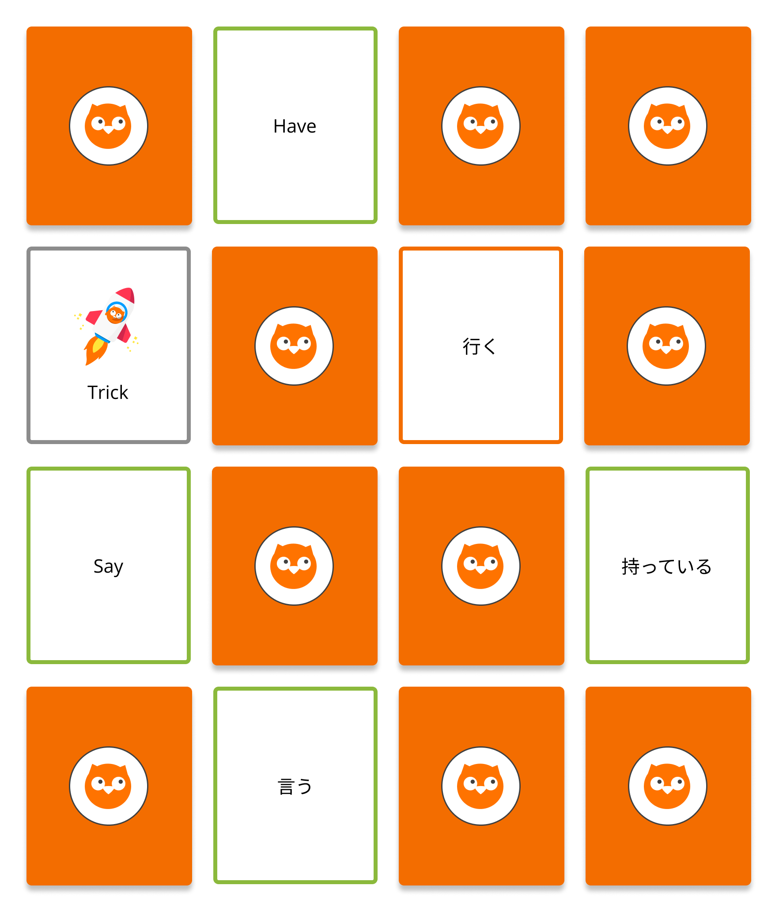
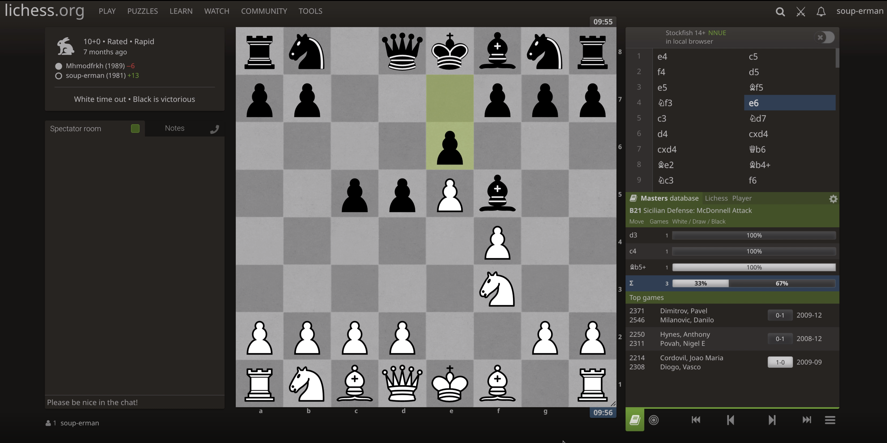

# Developer Project

We would like you to create a memory game, where cards are flipped over to find pairs of corresponding words in Japanese and English with the same meaning.


_An example of what the game might look like. In this case "Say" matches "言う" and "Have" matches "持っている." "行く" is a flipped card that is still unmatched. The "Trick" card is a [special effects card](#special-effect-cards)._

## API and Content structure

Please use the data provided in the api folder to provide content for the game. The cards should be pairs of Japanese-English words, where one side is the translation of the other.

Our top-level structure for content is a `goal`. This represents a course on https://iknow.jp

A goal has `goal_items`, which contain a `cue` and a `response`. The cue contains data for the language being studied. The response contains data for the native language of the learner.

A `goal_item` also has a position, sound, and example sentences, which themselves have audio and an image. Here's a sample entry:

```json
    {
      "item": {
        "id": 34891,
        "type": "text",
        "cue": {
          "text": "have",
          "image": null,
          "language": "en",
          "part_of_speech": "Verb",
          "transcription": "hæv",
          "transliterations": {}
        },
        "response": {
          "text": "持っている",
          "language": "ja",
          "transliterations": {
            "Hira": "もっている",
            "Hrkt": "もっている",
            "Latn": "motteiru"
          }
        }
      },
      "position": 1,
      "sound": "http://assets1.iknow.jp/assets/legacy/core/audio/core1_1_q_1.mp3",
      "sentences": [
        {
          "position": 1,
          "cue": {
            "id": 12375,
            "language": "en",
            "text": "I <b>have</b> a lot of money."
          },
          "response": {
            "id": 30730,
            "language": "ja",
            "text": "私はお金をたくさん持っている。",
            "transliterations": {
              "Hira": "わたし は おかね を たくさん もっている 。",
              "Hrkt": "わたし は おかね を たくさん もっている 。",
              "Latn": "watashi ha okane wo takusan motteiru .",
              "Jpan": "私 は お金 を たくさん 持っている 。"
            }
          },
          "image": "http://assets1.iknow.jp/assets/legacy/images/01/3004759.jpg",
          "sound": "http://assets1.iknow.jp/assets/legacy/core/audio/core1_1_s1_1.mp3"
        },
      ]
     }
```


## Features

Please make a game using this template with at least the following features:

* Gameplay where the player flips over cards, where a pair of cards flip back over unless they have the same meaning (are the same item).
* Special effect cards (described below)
* Keep track of the length of a game, as well as the number of card flips, displayed during the game.
* Once one non-effect (word) card is flipped, start a timer. If the timer expires before the user flips over another word card, they lose the game.
* When the game starts, show a few non-matching cards to the player to help them get started.
* At the end of the game, reveal any cards that are not flipped (including effects cards).
* Store the game state such that playback features can be implemented.

### Special Effect Cards

In addition to the cards corresponding to word pairs, add a few special effect cards that change the game.

These cards should be added to the board and look like regular cards, but instead of prompting to flip another card and get a match,
flipping one of these cards activates its effect immediately. Please implement the following special effect cards:

* Timer — Increases time limit between flips for the next three moves.
* Shuffle — Reshuffles all the cards on the board. Flipped pairs and effect cards should remain faceup, but move. The shuffle card itself should not change position.
* Retry — The next time you flip over a non-matching card, you get another chance (the first one stays flipped and the timer resets).
* Trick — Unflips one pair of matched word cards but flips over another pair of words.

Note that it's not required to flip over all of these cards to finish the game. The game still ends when all pairs of word cards have been flipped faceup.

Flipping over an effect card should reset the move timer.

Insert a random selection of these cards into the board, along with the word cards.

There are edge cases to consider with effect cards—implement sensible behavior for any you encounter.

### Storing Game State

While implementing playback features is not expected, the game state should be persisted in a manner that would make implementing features such as replay and rewind feasible.

For example, some chess sites support a replay feature for users to watch back their games:



## Notes

Please use the JSON data in the api directory. You may also use the provided stylesheets and images.
Write your application as though it was production code: keep it well-factored for future expansion.
Leave room in your code design for new features, even though you won't implement them.

When implementing effect cards, consider that in a real product, new ones may be added or old ones taken away.
Focus mainly on logic over things like animation and presentation.
When you're finished, we'll chat about the code and how it could be expanded in a real product.
